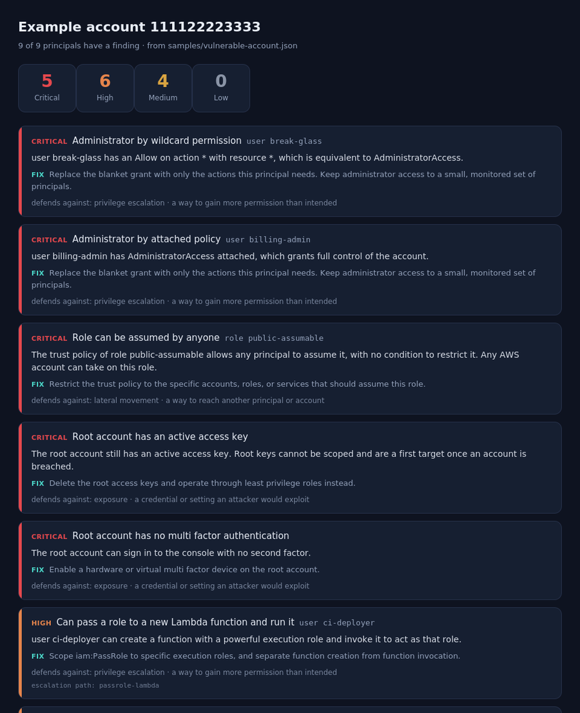

# Raqib

A read only lookout over your AWS IAM. It reads the export your account already produces and reports the paths an attacker would take: the privilege escalation moves a principal could make, role trust policies that let the wrong people in, wildcard permissions on sensitive services, and the stale keys and console logins that make a foothold easy. Each finding says why it is exploitable and the change that closes it.

Raqib (رقيب, the watcher) never calls AWS and never touches your account. You hand it a file, and it reasons about that file offline.

Live demo and a sample report: https://siteq8.github.io/Raqib/



## Why it exists

An attacker who lands a single set of credentials does not stop there. They look for a way to turn that access into more: a policy they can rewrite, an administrator policy they can attach to themselves, a role they can pass to a service they control, a password they can set on a more powerful user. These moves are well known and they live in the IAM configuration, in plain sight, before anyone uses them.

Raqib walks those same paths so you can close them first. It is the defensive side of the map: the same routes an attacker studies, read so a defender can shut them.

## What it looks for

Raqib checks each principal's effective permissions, after inline policies, attached managed policies, and group memberships are combined, against the known IAM escalation paths:

- Rewriting a policy the principal is attached to, or rolling it back to a more permissive version
- Attaching or writing an administrator policy onto a user, group, or role
- Setting or resetting a console password on another user, or minting access keys for one
- Adding itself to a group, or rewriting a role trust policy it can then assume
- Passing a powerful role to a new EC2 instance, Lambda function, Glue endpoint, CloudFormation stack, Data Pipeline, SageMaker notebook, or CodeBuild project

It also reads role trust policies for roles assumable by anyone, roles that trust an external account, and federated trust with no condition. It flags administrator by wildcard, and full control of a sensitive service through a service wildcard. With a credential report it adds root access keys, console users without multi factor authentication, and access keys that are old and still active.

Run `python3 raqib.py paths` to list every escalation path it checks.

## Install

Raqib is a single zero dependency Python tool. It needs Python 3.8 or newer and nothing else.

```
git clone https://github.com/SiteQ8/Raqib.git
cd Raqib
python3 raqib.py paths
```

## Use

Produce the IAM export, then audit it:

```
aws iam get-account-authorization-details > export.json
python3 raqib.py audit export.json
```

Add credential findings and write a shareable HTML report:

```
aws iam generate-credential-report
aws iam get-credential-report --query Content --output text | base64 --decode > creds.csv
python3 raqib.py audit export.json --credential-report creds.csv -o report.html
```

Gate a pipeline so a critical or high finding fails the build:

```
python3 raqib.py audit export.json --strict
```

Other options: `--json` for machine readable output, `--max-key-age DAYS` to set what counts as a stale key, `--title` to name the report.

## What a finding means, and what it does not

A finding says what a permission would allow, not that it was used. Raqib reads configuration, not activity. It tells you that a principal could rewrite an attached policy, not that anyone did.

A clean report means the export named nothing these rules look for. It does not mean the account is secure. Raqib checks the paths it knows about; it does not prove their absence everywhere, and it does not yet read resource policies, service control policies, or permissions boundaries, which can widen or narrow real access.

Raqib covers AWS IAM today. Azure and GCP and Kubernetes have the same shape of problem and are the natural next step.

## How it works

The audit runs entirely on the file you provide. The model reads `get-account-authorization-details` into principals, resolving each one's permissions across inline, attached, and group policies, with a matcher that understands IAM wildcards and lets an explicit Deny override an Allow. The rules test those resolved permissions against each escalation path, separating an unconditional grant on resource `*` from one a resource restriction may already contain. Nothing here executes anything, and nothing leaves your machine.

## License

MIT. See [LICENSE](LICENSE).
